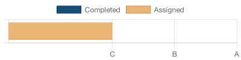

# Progress Report for William Waterson
    Note:  This is a draft of the progress report generator.  This version only shows the
    marks I have for each graded item.  Future reports will contain more detail.
## Learning Objectives
|Learning Objectives|Grade|Late Days|
|------|-------|-------|
|Origins (o1)|x .|0|
|Get/Post (m1)|**p**|0|
|Implementation (i1)|x|0|
|URL parts (i2)|x|0|
|Write CSS (h3)|**p**|0|

## Homework
|Homework|Grade|Late Days|
|------|-------|-------|
|Web Client (H1)|**p**|0|
|Web Server (H2)|**m**|0|
|Qwixx Board (H3)|.|0|

Current grade:  B

## Legend 
* `e`: Exceeds expectations
* `m`: Meets expectations
* `p`: Progressing
* `x`: Not Yet
* `.`: Missing
* `d`: Demonstrated but not yet graded
* `r`: Received but not yet graded
* `?`: Received; Grading in progress
* `!`: Error in gradesheet
